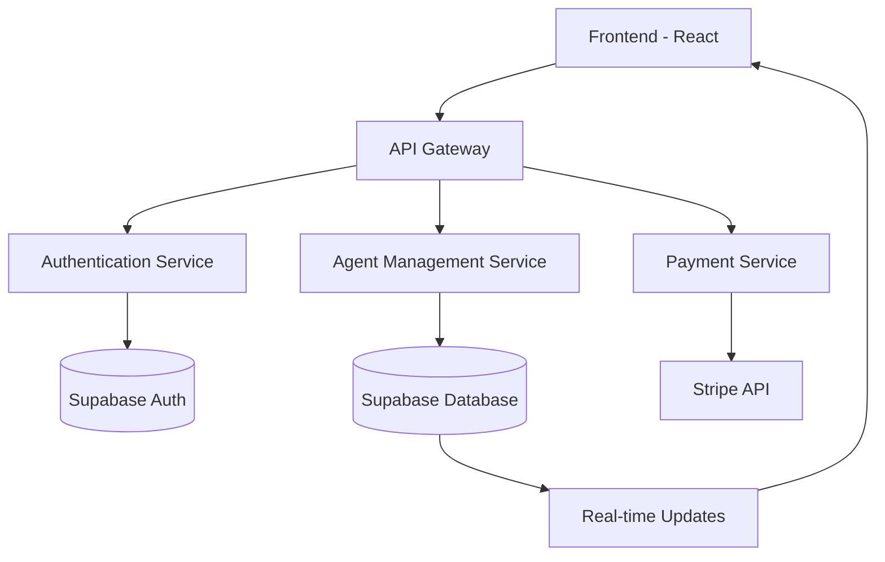

# AgentBay

<div align="center">
  
  
  <p><strong>🚀 The Future of AI Agent Management</strong></p>
  
  [](https://opensource.org/licenses/MIT)
  [](https://reactjs.org/)
  [](https://www.typescriptlang.org/)
  [](https://tailwindcss.com/)
  [](https://vercel.com/)
</div>

---

## 🌟 Overview

AgentBay is a sophisticated web application designed to streamline the creation, management, and deployment of AI-powered agents. Built with modern technologies and a focus on user experience, it empowers users to harness the power of AI without technical complexity.

### ✨ Key Features

- 🤖 **Intuitive Agent Creation** - Build AI agents with our visual wizard
- 🔐 **Secure Authentication** - OAuth integration with multiple providers
- 💳 **Payment Integration** - Stripe-powered subscription management
- 📊 **Real-time Dashboard** - Monitor your agents' performance
- 🌐 **API Integration** - Connect with external services seamlessly
- 📱 **Responsive Design** - Works perfectly on all devices

---

## 🛠 Tech Stack

<table>
<tr>
<td align="center"><strong>Frontend</strong></td>
<td align="center"><strong>Backend</strong></td>
<td align="center"><strong>Database</strong></td>
<td align="center"><strong>Deployment</strong></td>
</tr>
<tr>
<td align="center">
  <br/>
  React 18+
</td>
<td align="center">
  <br/>
  Node.js
</td>
<td align="center">
  <br/>
  Supabase
</td>
<td align="center">
  <br/>
  Vercel
</td>
</tr>
<tr>
<td align="center">
  <br/>
  Tailwind CSS
</td>
<td align="center">
  <br/>
  Express.js
</td>
<td align="center">
  <br/>
  PostgreSQL
</td>
<td align="center">
  <br/>
  GitHub Actions
</td>
</tr>
</table>

---

## 🚀 Quick Start

### Prerequisites

Make sure you have the following installed:

- **Node.js** (v18 or higher)
- **Bun** (recommended) or npm
- **Git**

### Installation

1. **Clone the repository**
   ```bash
   git clone https://github.com/yantr-manav/agentbay.git
   cd agentbay
   ```

2. **Install dependencies**
   ```bash
   bun install
   # or
   npm install
   ```

3. **Set up environment variables**
   ```bash
   cp .env.example .env.local
   ```
   
   Fill in your environment variables:
   ```env
   # Supabase
   VITE_SUPABASE_URL=your_supabase_url
   VITE_SUPABASE_ANON_KEY=your_supabase_anon_key
   
   # Stripe
   VITE_STRIPE_PUBLISHABLE_KEY=your_stripe_publishable_key
   STRIPE_SECRET_KEY=your_stripe_secret_key
   
   # OAuth
   VITE_OAUTH_CLIENT_ID=your_oauth_client_id
   OAUTH_CLIENT_SECRET=your_oauth_client_secret
   ```

4. **Start the development server**
   ```bash
   bun dev
   # or
   npm run dev
   ```

5. **Open your browser**
   Navigate to `http://localhost:5173`

---

## 📋 Project Structure

```
agentbay/
├── 📁 public/                 # Static assets
├── 📁 src/
│   ├── 📁 components/        # Reusable UI components
│   │   ├── 📁 ui/           # Base UI components
│   │   └── 📁 layout/       # Layout components
│   ├── 📁 pages/            # Application pages
│   ├── 📁 hooks/            # Custom React hooks
│   ├── 📁 services/         # API services
│   ├── 📁 utils/            # Utility functions
│   ├── 📁 types/            # TypeScript type definitions
│   └── 📁 styles/           # Global styles
├── 📁 tests/                # Test files
├── 📄 package.json
├── 📄 tailwind.config.js
├── 📄 vite.config.ts
└── 📄 README.md
```

---

## 🎯 Problem Statement & Solution

### The Challenge
In today's rapidly evolving AI landscape, there's a significant gap between the potential of AI agents and the ability of non-technical users to create and manage them effectively.

### Our Solution
AgentBay bridges this gap by providing:
- **Visual Agent Builder** - No coding required
- **Pre-built Templates** - Get started quickly
- **Integration Ecosystem** - Connect to popular services
- **Monitoring & Analytics** - Track performance in real-time

---

## 👥 Target Audience

- 👨‍💻 **Developers** seeking to integrate AI agents into applications
- 🏢 **Businesses** looking to automate workflows with AI
- 🎓 **Educators & Researchers** exploring AI frameworks
- 🚀 **Startups** building AI-powered products

---

## 🏗 Architecture

### System Overview


### Database Schema
- **users** - User profiles and preferences
- **agents** - Agent configurations and metadata
- **subscriptions** - Payment and subscription data
- **logs** - Agent activity and performance logs

---

## 🧪 Testing

### Running Tests
```bash
# Unit tests
bun test

# Integration tests
bun test:integration

# End-to-end tests
bun test:e2e

# Test coverage
bun test:coverage
```

### Test Structure
- **Unit Tests** - Component and function testing with Vitest
- **Integration Tests** - API and service integration testing
- **E2E Tests** - Full user journey testing with Playwright

---

## 🚀 Deployment

### CI/CD Pipeline
Our GitHub Actions workflow automatically:
1. ✅ Runs all tests
2. 🔍 Performs security checks
3. 📦 Builds the application
4. 🚀 Deploys to Vercel

### Environment Setup
- **Development** - Local development with hot reload
- **Staging** - Preview deployments for testing
- **Production** - Live application on Vercel

---

## 📊 Monitoring & Analytics

### Performance Monitoring
- **Vercel Analytics** - Performance metrics
- **Supabase Insights** - Database performance
- **Custom Dashboards** - Agent-specific analytics

### Error Tracking
- Real-time error reporting
- User session recordings
- Performance bottleneck detection

---

## 🛣 Roadmap

### Phase 1 - Core Features (✅ Completed)
- [x] User authentication system
- [x] Basic agent creation
- [x] Payment integration
- [x] Dashboard interface

### Phase 2 - Enhanced Features (🚧 In Progress)
- [ ] Advanced agent templates
- [ ] Multi-language support
- [ ] API marketplace
- [ ] Team collaboration tools

### Phase 3 - Enterprise Features (📋 Planned)
- [ ] On-premise deployment
- [ ] Advanced security features
- [ ] Custom integrations
- [ ] SLA guarantees

---

## 🤝 Contributing

We welcome contributions from the community! Here's how you can help:

### Getting Started
1. 🍴 **Fork the repository**
2. 🌿 **Create a feature branch**
   ```bash
   git checkout -b feature/amazing-feature
   ```
3. 💻 **Make your changes**
4. ✅ **Add tests for your changes**
5. 📝 **Commit your changes**
   ```bash
   git commit -m 'Add amazing feature'
   ```
6. 📤 **Push to your branch**
   ```bash
   git push origin feature/amazing-feature
   ```
7. 🔃 **Open a Pull Request**

### Contribution Guidelines
- Follow our [Code of Conduct](CODE_OF_CONDUCT.md)
- Write meaningful commit messages
- Add tests for new features
- Update documentation as needed

---

## 📞 Support & Community

- 📧 **Email**: support@agentbay.com
- 💬 **Discord**: [Join our community](https://discord.gg/agentbay)
- 🐛 **Issues**: [Report bugs](https://github.com/yantr-manav/agentbay/issues)
- 📖 **Documentation**: [Read the docs](https://docs.agentbay.com)

---

## 📄 License

This project is licensed under the MIT License - see the [LICENSE](LICENSE) file for details.

---

## 🙏 Acknowledgments

- Thanks to all contributors who have helped shape AgentBay
- Special thanks to the open-source community
- Built with ❤️ by the AgentBay team

---

<div align="center">
  <p><strong>Made with 💖 by the AgentBay Team</strong></p>
  <p>⭐ Star us on GitHub if you find this project useful!</p>
</div>
